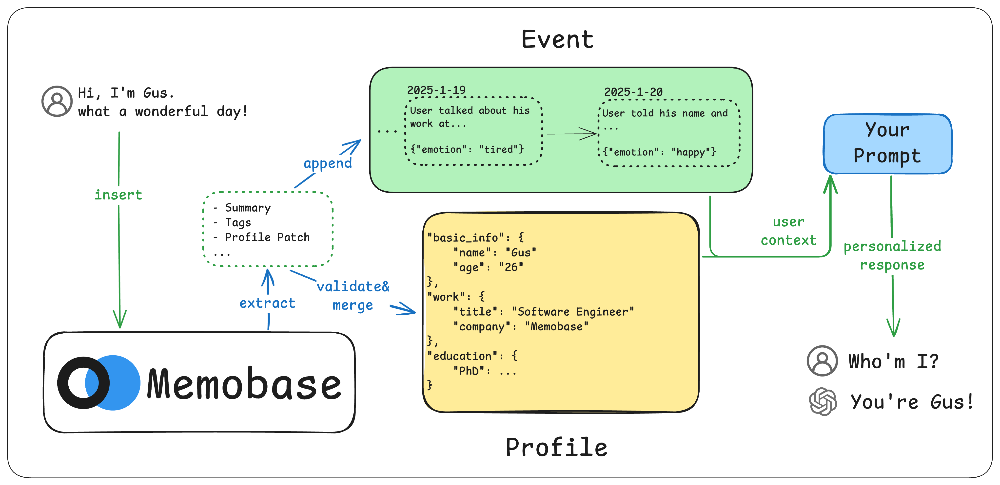
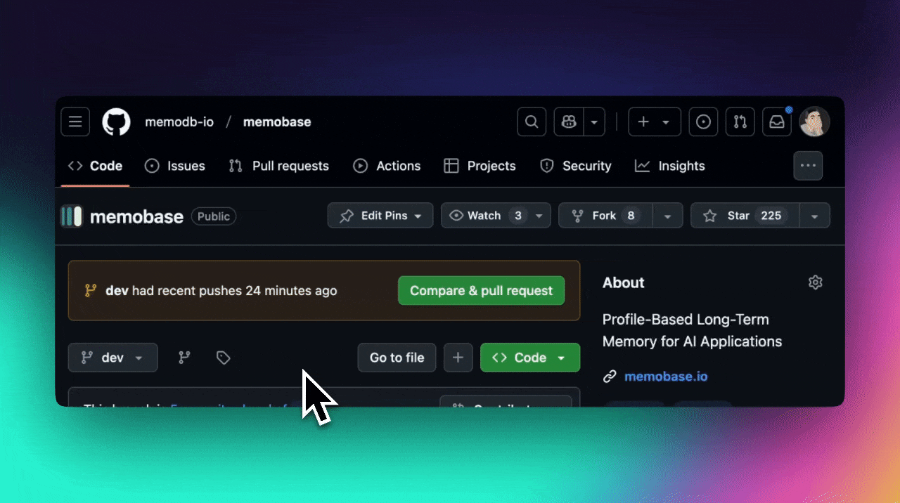

<div align="center">
  <h1>Powermemo</h1>
  <p>
    <a href="https://pypi.org/project/powermemo/">
      
    </a>
    <a href="https://www.npmjs.com/package/@powermemo/powermemo">
      
    </a>
    <a href="https://jsr.io/@powermemo/powermemo">
      
    </a>
    <a href="https://pkg.go.dev/github.com/memodb-io/powermemo/src/client/powermemo-go">
      
    </a>
    <a href="https://github.com/orgs/memodb-io/packages?repo_name=powermemo">
    
    </a>
  <a href="https://github.com/memodb-io/powermemo/actions/workflows/publish.yaml">
      
    </a>
  </p>
  <p>
    <a href="https://app.powermemo.io/playground">
       
    </a>
    <a href="https://discord.gg/YdgwU4d9NB">
      
    </a>
    <a href="https://github.com/memodb-io/powermemo/issues/61">
       
    </a>
  </p>
</div>


Powermemo is a **user profile-based memory system** designed to bring long-term user memory to your Generative AI (GenAI) applications. Whether you're building virtual companions, educational tools, or personalized assistants, Powermemo empowers your AI to **remember**,  **understand**, and **evolve** with your users.


Powermemo can provide you structured profiles of users, check out the [result](./docs/experiments/900-chats/readme.md) (compared with [mem0](https://github.com/mem0ai/mem0)) from a 900-turns real-world chatting:


<details>
<summary>Partial Profile Output</summary>


```python
{
  "basic_info": {
    "language_spoken": ["English", "Korean"],
    "name": "오*영"
  },
  "demographics": {
    "marital_status": "married"
  },
  "education": {
    "notes": "Had an English teacher who emphasized capitalization rules during school days",
    "major": "국어국문학과 (Korean Language and Literature)"
  },
  "interest": {
    "games": 'User is interested in Cyberpunk 2077 and wants to create a game better than it',
    'youtube_channels': "Kurzgesagt",
    ...
  },
  "psychological": {...},
  'work': {'working_industry': ..., 'title': ..., },
  ...
}
```

</details>


## Core Features

**🎯 Memory for User, not Agent**

Define and control exactly what user information your AI captures. 

📈 **SOTA**

check out performance on [public benchmark](./docs/experiments/locomo-benchmark) against mem0, langmem, zep...

📅 **Time-aware Memory**

Powermemo has more than user profiles, it also records [user event](https://docs.powermemo.io/features/event/event). User event is essiential to answer time-related question, see how we can [improve temporal memory much better](./docs/experiments/locomo-benchmark/README.md#Result) than other memory solutions.

**🖼️ Contorllable Memory**

Among all types of memory, only some may enhance your product experience. Powermemo offers a flexible configuration for you to [design the profile](https://docs.powermemo.io/features/profile/profile).

**🔌 Easy Integration**

Minimal code changes to integrate with your existing LLM stack with [API](https://docs.powermemo.io/api-reference/overview), [Python](https://pypi.org/project/powermemo/)/[Node](./src/client/powermemo-ts/README.md)/[Go](./src/client/powermemo-go/README.md) SDK.

**⚡️ Batch-Process**:

Powermemo offers every user a buffer to batch processing the chats after the conversation. Fast & Cheap.

**🚀 Production Ready**

Powermemo is building with FastAPI, Postgres and Redis, supporting request caching, authing, telemetry... [Fully dockerized](./src/server/readme.md).


<div align="center">
    <picture>
      
    </picture>
  <p>How Powermemo works?</p>
</div>


## Get Started

> Try our [playground](https://app.powermemo.io/playground) to see the memories in action

1. [Start your Powermemo server locally](./src/server/readme.md). If you don't want to be bothered, Powermemo Cloud provides [a free tier](https://www.powermemo.io/en/login) enough for your testing
2. You should have the below two things to continue:
   1. A project url. (local: `http://localhost:8019` , cloud `https://api.powermemo.dev`)
   2. A project token. (local: `secret` , cloud `sk-proj-xxxxxx`)
3. Install the Python SDK: `pip install powermemo`
4. Below tutorial is for Python User. For other language and API, check [this](https://docs.powermemo.io/quickstart).


## Step-by-step break down

> [!TIP]
>
> You can just run this equivalent [quickstart script](./assets/quickstart.py)
>
> Or you can keep things super easy by using [OpenAI SDK with Powermemo.](https://docs.powermemo.io/practices/openai), [Ollama with Powermemo](./assets/tutorials/ollama+powermemo)

### 1. Make sure you're connected

 ```python
 from powermemo import PowerMemoClient, ChatBlob
 
 mb = PowerMemoClient(
     project_url=PROJECT_URL,
     api_key=PROJECT_TOKEN,
 )
 assert mb.ping()
 ```

### 2. Manage Users

```python
uid = mb.add_user({"any_key": "any_value"})
mb.update_user(uid, {"any_key": "any_value2"})
u = mb.get_user(uid)
print(u)

# mb.delete(uid)
```

### 3. Insert Data

> In Powermemo, all types of data are blobs to a user that can insert, get and delete:

```python
messages = [
  {
      "role": "user",
      "content": "Hello, I'm Gus",
  },
  {
      "role": "assistant",
      "content": "Hi, nice to meet you, Gus!",
  }
]
bid = u.insert(ChatBlob(messages=messages))
print(u.get(bid)) # not found once you flush the memory.

# u.delete(bid)
```

> Be default, Powermemo will remove the blobs once they're processed. This means that apart from the relevant memory, your data will not be stored with Powermemo. You can persist the blobs by adjusting the [configuration file](https://docs.powermemo.io/features/customization/full#storage-config).

### 4. Get your Memory

```python
u.flush()
```

And what will you get?

```python
print(u.profile(need_json=True))

# results
{
  "basic_info": {
    "name": {
      "content": "Gus",
      "id": ...,
      "created_at": ...
    }
  }
}
```

`u.profile()` will return structured profiles that are learned from this user, including `topic`, `sub_topic` and `content`. As you insert more blobs, the profile will become better.

<details>
<summary> Why need a flush?</summary>

In Powermemo, we don't memoize users in [hot path](https://langchain-ai.github.io/langgraph/concepts/memory/#writing-memories-in-the-hot-path). We use buffer zones for the recent inserted blobs.

When the buffer zone becomes too large (e.g., 1024 tokens) or remains idle for an extended period (e.g., 1 hour), Powermemo will flush the entire buffer into memory.  Alternatively, you can use `flush()` manually decide when to flush, such as when a chat session is closed in your app.
</details>


### 5. Integrate memory into your prompt

Powermemo has a `context` api to pack everything you need into a simple string, where you can insert it into your prompt directly:

```python
print(u.context(max_token_size=500, prefer_topics=["basic_info"]))
```

Something like:

```
<memory>
# Below is the user profile:
- basic_info::name: Gus
...
# Below is the latest events of the user:
2025/02/24 04:25PM:
- work::meetings: Scheduled a meeting with John.
...
</memory>
Please provide your answer using the information within the <memory> tag at the appropriate time.
```

Checkout the detail params [here](https://docs.powermemo.io/api-reference/prompt/get_context).

### What's next?

- Checkout the [quickstart script](./assets/quickstart.py) for more details
- You may want to explore the [customization](https://docs.powermemo.io/features/profile/profile) of Powermemo to make sure the system works as your expectation.
- If you want to test Powermemo on your own data, we offer a [script](./docs/experiments/chat_sessions) that allows you to set multiple chat sessions and see how the memory grows.
- See our [integrations](https://docs.powermemo.io/templates/livekit) to find anything may help you.


## Why/Where should I use Powermemo?

### Remember the users 

By placing profiles into your AI (*e.g.* system prompt).

<details>
<summary>Demo</summary>


```python
PROFILES = "\n".join([p.describe for p in u.profile()])

print(PROFILES)
# basic_info: name - Gus
# basic_info: age - 25
# ...
# interest: foods - Mexican cuisine
# psychological: goals - Build something that maybe useful
# ...
```

</details>

### User analysis and tracking

Too much information is hidden in the conversations between users and AI, that's why you need a new data tracking method to record user preference and behavior.

<details>
<summary>Demo</summary>


```python
PROFILES = u.profile()

def under_age_30(p):
  return p.sub_topic == "age" and int(p.content) < 30

def love_cat(p):
  return p.topic == "interest" and p.sub_topic == "pets" and "cat" in p.content

is_user_under_30 = (
    len([p for p in profiles if under_age_30(p)]) > 0
)
is_user_love_cat = (
  len([p for p in profiles if love_cat(p)]) > 0
)                       
...
```
</details>

### Sell something to your customers.  

Not everyone is looking for Grammarly, it's always nice to sell something your users might want. 

<details>
<summary>Demo</summary>


```python
def pick_an_ad(profiles):
  work_titles = [p for p in profiles if p.topic=="work" and p.sub_topic=="title"]
  if not len(work_titles):
    return None
  wt = work_titles[0].content
  if wt == "Software Engineer":
    return "Deep Learning Stuff"
  elif wt == "some job":
    return "some ads"
  ...
```
</details>


## Documentation

For detailed usage instructions, visit the [documentation](https://docs.powermemo.io/). 


## Stay Updated

Star Powermemo on Github to support and receive instant notifications!




## Support

Join the community for support and discussions:

-  [Join our Discord](https://discord.gg/YdgwU4d9NB) 👻 

- [Follow us on Twitter](https://x.com/powermemo_io) 𝕏 

Or Just [email us](mailto:contact@powermemo.io) ❤️


## Contribute

- Check out our [Changelog](./Changelog.md) first, make sure the feature you want has not been developed or is currently being planned.:)
- Go through [Contributing](./CONTRIBUTING.md) document to setup and contribute to Powermemo.


## License

This project is licensed under the Apache 2.0 License - see the [LICENSE](https://github.com/memodb-io/powermemo/blob/main/LICENSE) file for details.
