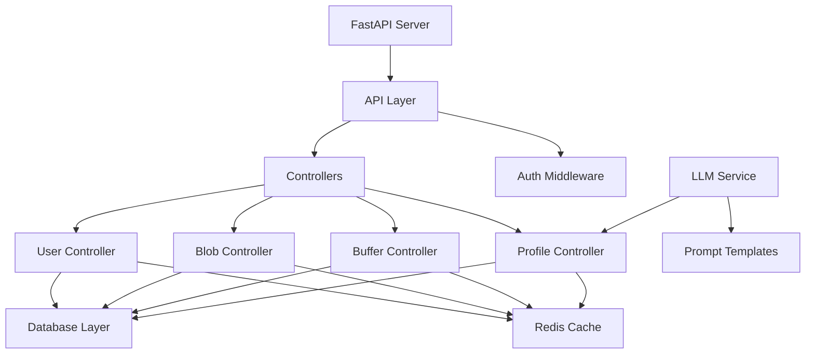
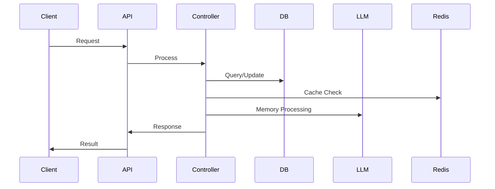
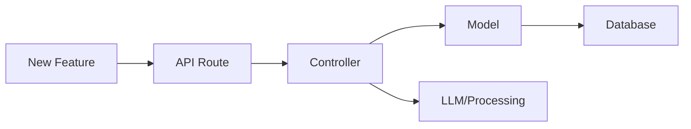

> Generated by Claude 3.5 Sonnet
# Powermemo Architecture Guide

## Project Overview

Powermemo is a user memory system for LLM applications that maintains persistent user context and memory. This guide will help you understand the system architecture and navigate the codebase.

## System Architecture



## Directory Structure

```
powermemo/
├── api/                      # API Definitions
│   └── api.py               # FastAPI routes and middleware
├── models/                   # Data Models
│   ├── database.py          # SQLAlchemy models
│   ├── blob.py              # Data blob definitions
│   ├── response.py          # API response structures
│   └── utils.py             # Utilities and Promise pattern
├── controllers/             # Business Logic
│   ├── user/               # User management
│   ├── blob/               # Data blob handling
│   ├── buffer/             # Memory buffer operations
│   ├── profile/            # User profile management
│   └── modal/              # Modal processing
├── connectors/             # External Services
│   └── connectors.py       # Database and Redis connections
├── llms/                   # LLM Integration
│   ├── __init__.py        # LLM service initialization
│   └── openai.py          # OpenAI implementation
└── prompts/               # LLM Prompt Templates
```

## Data Flow



## Key Components

### 1. Entry Points
- FastAPI Server: `api.py`
- Main Routes: `/api/v1/*`
- Health Check: `/api/v1/healthcheck`

### 2. Core Services
- User Management
- Memory Storage
- Profile Processing
- Buffer Management

### 3. External Dependencies
- PostgreSQL Database
- Redis Cache
- OpenAI/LLM Service

## Quick Start Routes

### User Flow
1. Create User: `POST /api/v1/users`
2. Get Profile: `GET /api/v1/users/profile/{user_id}`
3. Update User: `PUT /api/v1/users/{user_id}`

### Memory Flow
1. Insert Memory: `POST /api/v1/blobs/insert/{user_id}`
2. Process Buffer: `POST /api/v1/users/buffer/{user_id}/{buffer_type}`
3. Get Profile: `GET /api/v1/users/profile/{user_id}`

## Configuration Points

### Environment Setup
```bash
.env
├── DATABASE_URL
├── REDIS_URL
├── PROJECT_ID
└── ACCESS_TOKEN
```

### System Config
```yaml
config.yaml
├── buffer_flush_interval
├── max_chat_blob_buffer_token_size
├── language
└── llm_style
```

## Development Flow



## Common Development Paths

### 1. Adding New Features
1. Define route in `api.py`
2. Create controller in `controllers/`
3. Add model in `models/`
4. Update response types

### 2. Modifying Memory Processing
1. Update prompts in `prompts/`
2. Modify profile controller
3. Adjust buffer settings

### 3. Database Changes
1. Update models in `models/database.py`
2. Modify controllers
3. Update response types

## Testing Routes

### Core Functionality
```bash
# Health Check
curl -X GET http://localhost:8019/api/v1/healthcheck

# Create User
curl -X POST http://localhost:8019/api/v1/users -H "Content-Type: application/json" -d '{"data":{}}'

# Get Profile
curl -X GET http://localhost:8019/api/v1/users/profile/{user_id}
```

## Common Integration Points

### 1. LLM Integration
- Location: `llms/`
- Config: `env.py`
- Prompts: `prompts/`

### 2. Database Integration
- Models: `models/database.py`
- Connection: `connectors.py`
- Queries: Controllers

### 3. Cache Integration
- Redis Config: `connectors.py`
- Buffer System: `controllers/buffer/`
- Cache Keys: `utils.py`